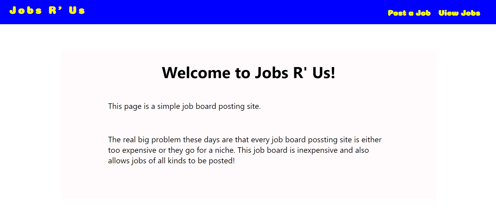
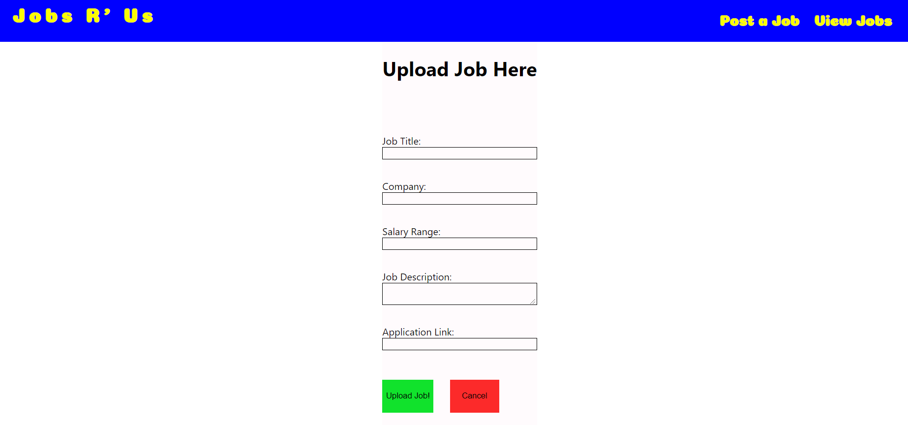
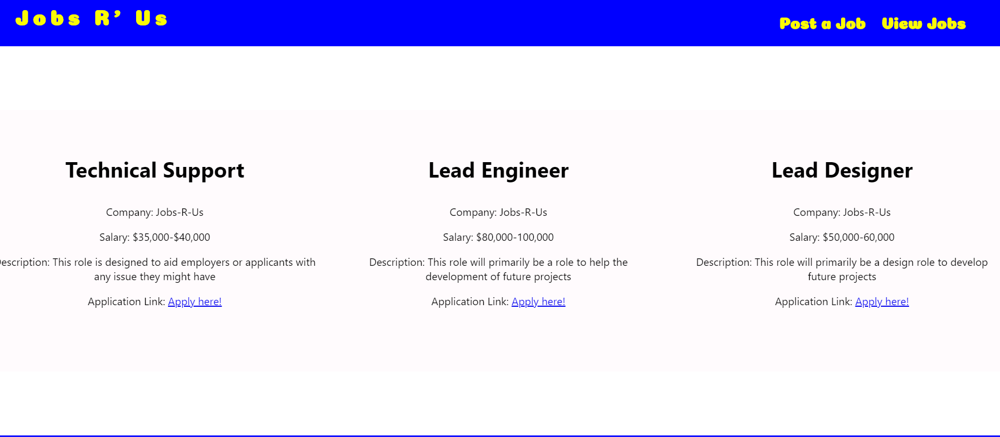

<h1>Jobs R' Us</h1>

This is a react application to provide a job board.

Looking at job boards these days they are either too expensive to post on or it's for certain niches. This job board can be used to help smaller businesses by providing them a cheaper option for job bords, and they don't have to worry about their niche. 

This application was made using React and tested using Jest. 

I came up with the name "Jobs R' Us" because Toys R' Us use to be a great option for toys if you weren't looking for something specific. Which is also why the theme has a Toys R' Us feel to it. 

